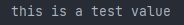

# BetterConfig

BetterConfig is config library used to create  config structures for projects

## Installation

Use the package manager [pip](https://pip.pypa.io/en/stable/) to install betterconfig.

```bash
pip install better-configuration
```

## Usage

```python

from betterconfiguration import config

test_config = config.BaseConfig("test", "this is a test value")

print(test_config.test)
```
### Result


## How to use
Betterconfiguration "creates" variables with values but its just not visible, in the example above, the first thing it puts is the variable name "test"
and then the value "this is a test value" this is the syntax of the library. you can put up to 5 variables per configuration structure.
```python

from betterconfiguration import config

test_config = config.BaseConfig("test", "this is a test value", "first", "this is the first value", "test2", "this is test2", "test3", "this is test3", "test4", "this is test4")

print(test_config.test)

print(test_config.first)

print(test_config.test2)

print(test_config.test3)

print(test_config.test4)
```
## Contributing

Pull requests are welcome. For major changes, please open an issue first
to discuss what you would like to change.

Please make sure to update tests as appropriate.

## License

[MIT](https://choosealicense.com/licenses/mit/)
